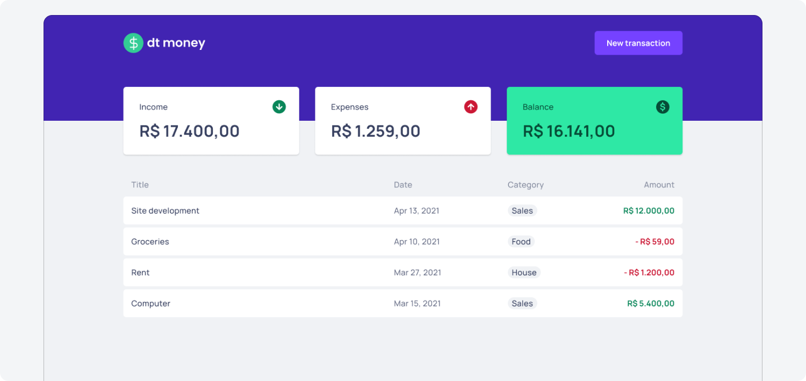

# DT Money App - Exercise 3 from Ignite

In order to practice some React.js concepts, we built a simple budget-tracker web app as a practice project during Ignite course.

Concepts and tools:

- Type annotation with Typescript
- React components
- React hooks (useState, useEffect, useContext) and context API
- Styled Components
- Fake API with Mirage.js
- Consuming fake API with Axios

<be>

Implemented features:

- Adding new transactions via modal component
- Consuming and saving data to a fake API
- Calculating and displaying data summary based on created transactions
- Listing transactions

## Project screenshot

 
